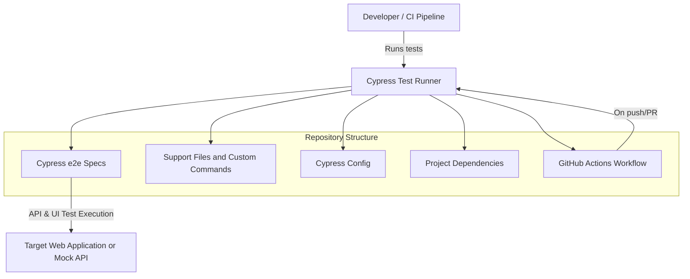

# automaton-v30

This project is a Cypress testing framework designed to run end-to-end tests for web applications. Users can define and execute automated tests to ensure the quality and functionality of their web applications through automated browser testing.

## Architecture Diagram

Below is a high-level architecture diagram showing the main components and their interactions in this Cypress testing framework:



**Legend:**
- **Cypress Test Runner**: Runs the tests in the `cypress/e2e` directory.
- **Support Files**: Custom commands and hooks in `cypress/support`.
- **Configuration**: Centralized options in `cypress.config.js`.
- **Dependencies**: Listed in `package.json`.
- **CI Integration**: Automated by `.github/workflows/cypress-test.yml`.
- **Test Target**: The web application or API under test.

## Recent Updates
- Added BDD Cucumber integration planning and documentation
- Enhanced project documentation with detailed structure and contribution guidelines
- Implemented initial Cypress testing framework setup

## Project Structure

*   `cypress/`: This directory contains all the Cypress test-related files.
    *   `e2e/`: Holds the end-to-end test specifications (e.g., `spec.cy.js`). These files contain the actual test scripts that simulate user interactions with the application.
    *   `support/`: Contains reusable custom commands and global configurations that can be used across different test files. `commands.js` is a common place to define custom Cypress commands, and other global configuration settings.
*   `.github/workflows/`: This directory contains GitHub Actions workflow configurations.
    *   `cypress-test.yml`: Defines a workflow that automatically runs the Cypress tests, likely on every push or pull request to the repository. This helps in continuous integration by ensuring tests pass before code is merged.
*   `cypress.config.js`: This is the main configuration file for Cypress. It allows you to customize various aspects of the Cypress test runner, such as base URL, viewport size, and environment variables.
*   `package.json`: Defines the project's metadata, including dependencies (like Cypress), and scripts for managing and running the project (e.g., `npm install`, test scripts).
*   `package-lock.json`: Records the exact versions of dependencies used in the project, ensuring consistent installations across different environments.

## Getting Started

To get started with this project, follow these steps:

1.  **Clone the repository:**
    ```bash
    git clone <repository-url>
    cd automaton-v30
    ```

2.  **Install dependencies:**
    Make sure you have Node.js and npm installed. Then, run the following command in the project root to install the necessary dependencies defined in `package.json`:
    ```bash
    npm install
    ```

3.  **Run Cypress tests:**
    You can run the Cypress tests using the following command. This will typically open the Cypress Test Runner, allowing you to see the tests execute in a browser.
    ```bash
    npx cypress open
    ```
    To run the tests in headless mode (e.g., in a CI environment), use:
    ```bash
    npx cypress run
    ```

## Contributing

Contributions are welcome! If you'd like to contribute to this project, please follow these guidelines:

1.  **Fork the repository.**
2.  **Create a new branch** for your feature or bug fix:
    ```bash
    git checkout -b my-new-feature
    ```
3.  **Make your changes.**
4.  **Ensure all tests pass** before submitting a pull request:
    ```bash
    npx cypress run
    ```
5.  **Commit your changes** with a clear and descriptive commit message:
    ```bash
    git commit -am 'Add some feature'
    ```
6.  **Push to your forked repository:**
    ```bash
    git push origin my-new-feature
    ```
7.  **Create a Pull Request** to the main repository.

Please ensure your code adheres to any existing style guidelines and that your changes are well-tested.

## Upcoming Features

The following features are planned for implementation:

1. **BDD with Cucumber Integration**
   - Implementation planned using [cypress-cucumber-preprocessor](https://github.com/badeball/cypress-cucumber-preprocessor)
   - Following the [Cucumber implementation guide](https://filiphric.com/cucumber-in-cypress-a-step-by-step-guide)
   - This will enable behavior-driven development practices in our testing framework